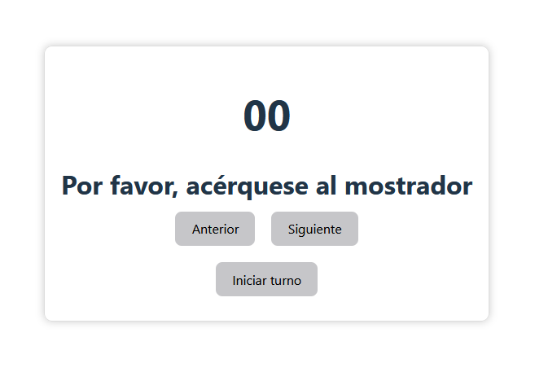
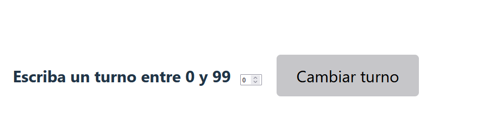
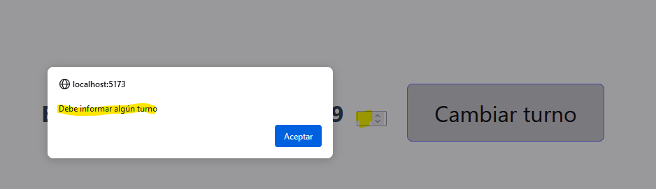

# Laboratorio Módulo 4 Funciones

## Turno en una clínica


<p>Queremos implementar una pantalla en la que aparezca un display con el turno actual de una clínica y un botón para pasar al siguiente turno y otro para volver al anterior.</p>

# Resultado

<p>Utilizaré el <a href="https://github.com/Lemoncode/typescript-sandbox" title="sandbox de TS"> sandbox de TypeScript</a> para la resolución. </p>

<p>A implementar:</p>

### Básico

<p>

- En grande se muestra el turno.
- El operario puede ir dándole a siguiente o anterior y el turno cambia.

- Además de esto vamos a añadir un botón de reset que pone el turno a 0.
</p>

<p>Y el resultado:</p>



### Avanzado

<p>Como challenge puedes añadir una caja de texto y un botón que permita cambiar el turno a un valor que ponga el operario.</p>

<p>Y el resultado:</p>



<p>Primero definimos los botones y asociamos el click a la función correspondiente</p>

```TypeScript
const btAnterior = document.getElementById("bt-anterior");
btAnterior?.addEventListener("click", anterior);

const btSiguiente = document.getElementById("bt-siguiente");
btSiguiente?.addEventListener("click", siguiente);

const btReset = document.getElementById("bt-reset");
btReset?.addEventListener("click", reset);

const btCambio = document.getElementById("bt-cambio");
btCambio?.addEventListener("click", cambio);

```

<p>Definimos dos funciones que usaremos en todas las funciones

- saberTurno: para recuperar del DOM el turno actual

- nuevoTurno: para actualizar el turno en el DOM. Se incluye la función padStart para incluir un cero delante del turno.
</p>

```TypeScript
function saberTurno() {
  turno = document.getElementById("numero-turno")!;
  turnoNum = parseInt(turno.innerHTML);
}

function nuevoTurno() {
  const resultadoElement = document.getElementById("numero-turno");
  const turnoRelleno = newTurno.toString().padStart(2, "0");
  if (resultadoElement !== null && resultadoElement !== undefined) {
    resultadoElement.innerHTML = turnoRelleno.toString();
  }
}
```

<p>Y definimos las funciones que se ejecutarán en función del botón

- anterior

</p>

```TypeScript
function anterior() {
  saberTurno();
  //Incluyo condición para que solo reste un turno si el turno actual no es 00
  if (turnoNum !== 0) {
    newTurno = turnoNum - 1;
    nuevoTurno();
  }
}
```

<p>

- siguiente

</p>

```TypeScript
function siguiente() {
  saberTurno();
  //Incluyo condición para que solo sume un turno si el turno actual no es 99
  if (turnoNum !== 99) {
    newTurno = turnoNum + 1;
    nuevoTurno();
  }
  //Incluyo condición para que inicie el turno si es 99
  if (turnoNum == 99) {
    reset();
  }
}
```

<p>

- reset

</p>

```TypeScript
function reset() {
  newTurno = 0;
  nuevoTurno();
}
```

<p>

- cambio

</p>

```TypeScript
function cambio() {
  otroTurno = parseInt(
    (document.getElementById("otroturno") as HTMLInputElement)?.value
  );
  //Incluyo condición para que solo se introduzcan turnos entre 0 y 99
  //y que no pueda ser espacios

  if (otroTurno < 0 || otroTurno > 99 || isNaN(otroTurno) == true) {
    if (otroTurno < 0 || otroTurno > 99) {
      alert(
        "El turno introducido no es correcto debe tener un valor entre 0 y 99"
      );
    } else {
      alert("Debe informar algún turno");
    }
  } else {
    newTurno = otroTurno;
    nuevoTurno();
  }
}
```

<p> En esta función se han incluido alertas para que no se informe con espacios</p>



<p> Y para que el turno esté entre 0 y 99</p>


