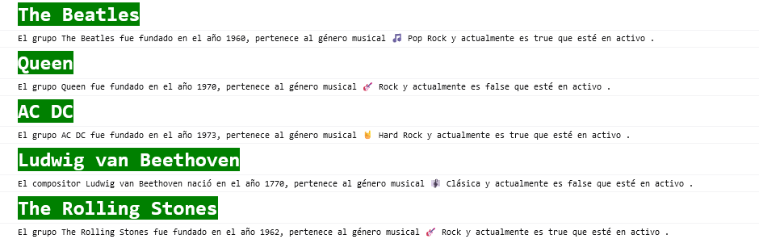

## Laboratorio Módulo 3 Variables

## Grupos musicales

<p>Queremos mostrar información acerca de grupos musicales.</p>


Si estás trabajando con TypeScript habría que crear un interfaz para representar a un grupo musical.

- Nombre del grupo / cantante / compositor (string).

- Año de fundación: cuando se formó el grupo (numero).

- Si está en activo (booleano).

- Género musical (string).

Cada género queremos tenerlo en una variable.

Los grupos que vamos a mostrar:

- The Beatles / 1960 / Activo: true / 🎵 Pop Rock

- Queen / 1970 / Activo: false / 🎸 Rock

- AC DC / 1973 / Activo: true / 🤘 Hard Rock

- Ludwig van Beethoven / 1770 / Activo: false / 🎼 Clásica

- The Rolling Stones / 1962 / Activo: true / 🎸 Rock

Queremos mostrar cada grupo por consola, el nombre del grupo de música queremos ponerlo en negrita, con fuente más grande y color de fondo verde.

## Resultado

<p>Utilizaré el <a href="https://github.com/Lemoncode/typescript-sandbox" title="sandbox de TS"> sandbox de TypeScript</a> para la resolución. </p>

<p>Definimos una variable para el estilo de letra del Grupo musical</p>

```JavaScript
const estiloGrupo =
  "color:white;font-weight: bold; font-size:25px;background-color:green";
```

<p>Y las variables para los géneros musicales</p>

```JavaScript
const PopRock: string = "🎵 Pop Rock";
const Rock: string = "🎸 Rock";
const HardRock: string = "🤘 Hard Rock";
const Clasica: string = "🎼 Clásica";
```

<p>Creamos una interface donde indicamos el tipo de cada variable del grupo musical</p>

```TypeScript
interface GrupoMusical {
  nombre: string;
  añoFundacion: number;
  activo: boolean;
  genero: string;
}
```

<p>Definimos una variable de tipo objeto para cada grupo y le indicamos que es del tipo de la interface GrupoMusical</p>

```TypeScript
const grupoA: GrupoMusical = {
  nombre: "The Beatles",
  añoFundacion: 1960,
  activo: true,
  genero: PopRock,
};
const grupoB: GrupoMusical = {
  nombre: "Queen",
  añoFundacion: 1970,
  activo: false,
  genero: Rock,
};
const grupoC: GrupoMusical = {
  nombre: "AC DC",
  añoFundacion: 1973,
  activo: true,
  genero: HardRock,
};
const grupoD: GrupoMusical = {
  nombre: "Ludwig van Beethoven",
  añoFundacion: 1770,
  activo: false,
  genero: Clasica,
};
const grupoE: GrupoMusical = {
  nombre: "The Rolling Stones",
  añoFundacion: 1962,
  activo: true,
  genero: Rock,
};
```

<p>Utilizamos backticks e interpolación para sustituir las variables en la cadena de texto</p>

```TypeScript
console.log(`%c${grupoA.nombre}`, estiloGrupo);
console.log(
  `El grupo ${grupoA.nombre} fue fundado en el año ${grupoA.añoFundacion}, pertenece al género musical ${grupoA.genero} y actualmente es ${grupoA.activo} que esté en activo .`
);

console.log(`%c${grupoB.nombre}`, estiloGrupo);
console.log(
  `El grupo ${grupoB.nombre} fue fundado en el año ${grupoB.añoFundacion}, pertenece al género musical ${grupoB.genero} y actualmente es ${grupoB.activo} que esté en activo .`
);
console.log(`%c${grupoC.nombre}`, estiloGrupo);
console.log(
  `El grupo ${grupoC.nombre} fue fundado en el año ${grupoC.añoFundacion}, pertenece al género musical ${grupoC.genero} y actualmente es ${grupoC.activo} que esté en activo .`
);
console.log(`%c${grupoD.nombre}`, estiloGrupo);
console.log(
  `El compositor ${grupoD.nombre} nació en el año ${grupoD.añoFundacion}, pertenece al género musical ${grupoD.genero} y actualmente es ${grupoD.activo} que esté en activo .`
);
console.log(`%c${grupoE.nombre}`, estiloGrupo);
console.log(
  `El grupo ${grupoE.nombre} fue fundado en el año ${grupoE.añoFundacion}, pertenece al género musical ${grupoE.genero} y actualmente es ${grupoE.activo} que esté en activo .`
);
```

Y por consola


