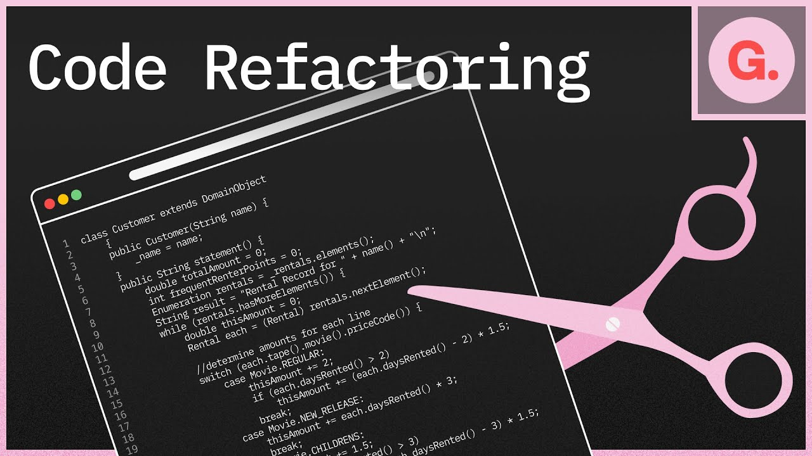

# Laboratorio Módulo 6 Imports

## Enunciado

<p>¿Te acuerdas de la <a href="https://github.com/beatrizgongar/bootcampjs2-LaboratorioModulo5/tree/main" title="Práctica de condicionales"> práctica de condicionales</a>? En ella, implementamos el juego de cartas de las siete y media. ¿Qué te parece si hacemos una limpia 😀?</p>
<p>En esta práctica vamos a refactorizar el código para que sea más mantenible y reutilizable, siguiendo los mismos principios que aplicamos en este módulo.</p>

[](https://code.visualstudio.com/docs/typescript/typescript-refactoring)

## Apartados Obligatorios

### Modelo

<p> Extrae la parte que define el modelo de datos a un fichero modelo.ts.</p>

### Motor

<p>Extrae la parte que define las reglas a un fichero motor.ts</p>

### UI

<p>Extrae la parte que define el UI a un fichero ui.ts</p>

<p>Se hace limpia en main.ts.</p>

<p>Asegúrate que sigue todo funcionando y no salen errores por consola.
</p>

## Apartados Opcionales

<p>¿Te animas a crear un objeto partida y su método de ayuda para crear una partida?</p>

<p>Asegúrate que sigue todo funcionando y no salen errores por consola.</p>

## Resultado

<p>Creamos los siguientes ficheros:

- Modelo: donde agrupamos la información de la partida, hemos creado una interfaz Partida y un objeto partida para guardar la información.

```TypeScript
interface Partida {
  listaMezclada: number[];
  listaPuntuacion: number[];
  numeroCarta: number;
  puntuacion: number;
  nuevaPartida: boolean;
  plantado: boolean;
}

export const partida: Partida = {
  listaMezclada: [],
  listaPuntuacion: [],
  numeroCarta: 0,
  puntuacion: 0,
  nuevaPartida: false,
  plantado: false,
};

```

- Motor: donde se incluyen las reglas del juego con las funciones para gestionar la partida. Dentro de este fichero hemos creado una función iniciarPartida()

```TypeScript
export const iniciarPartida = () => {
  partida.listaMezclada = [];
  partida.listaPuntuacion = [];
  partida.numeroCarta = 0;
  partida.puntuacion = 0;
  partida.nuevaPartida = false;
  partida.plantado = false;
  barajar();
  muestraPuntuacion();
};

```

- UI: donde se incluye todo lo relativo a interactuar con HTML.

Y de manera adicional hemos creado el fichero shell que sirve para arrancar la aplicación

```TypeScript
/*--- MOTOR ---*/
import { iniciarPartida } from "./motor";

/*-----VALIDA SI ESTÁ EL DOM cargado------*/
document.addEventListener("DOMContentLoaded", iniciarPartida);
```

Que es usado en main.ts

```TypeScript
import "./shell";
```

</p>
