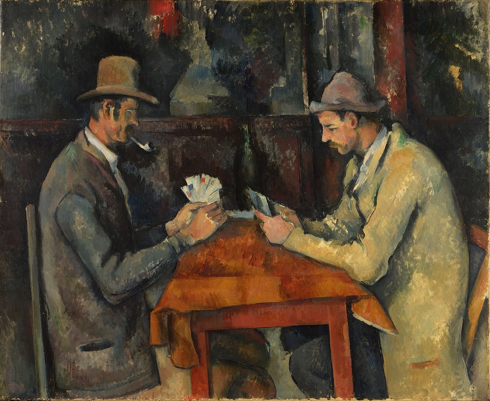
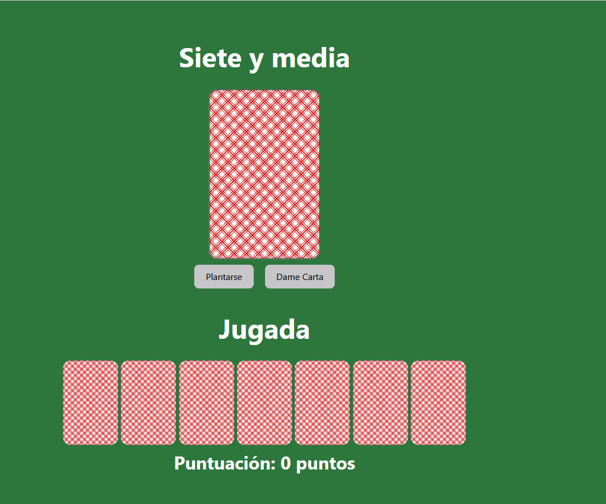
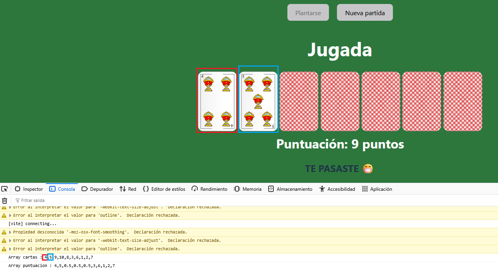
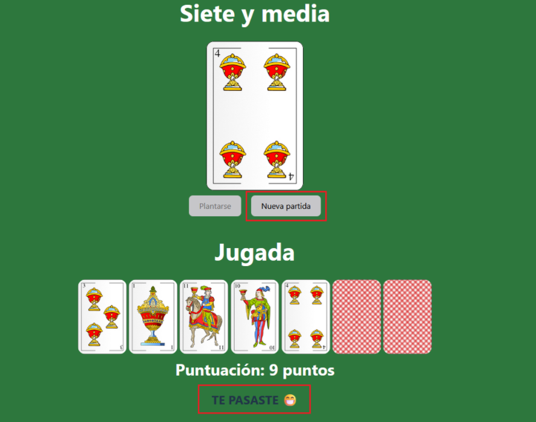
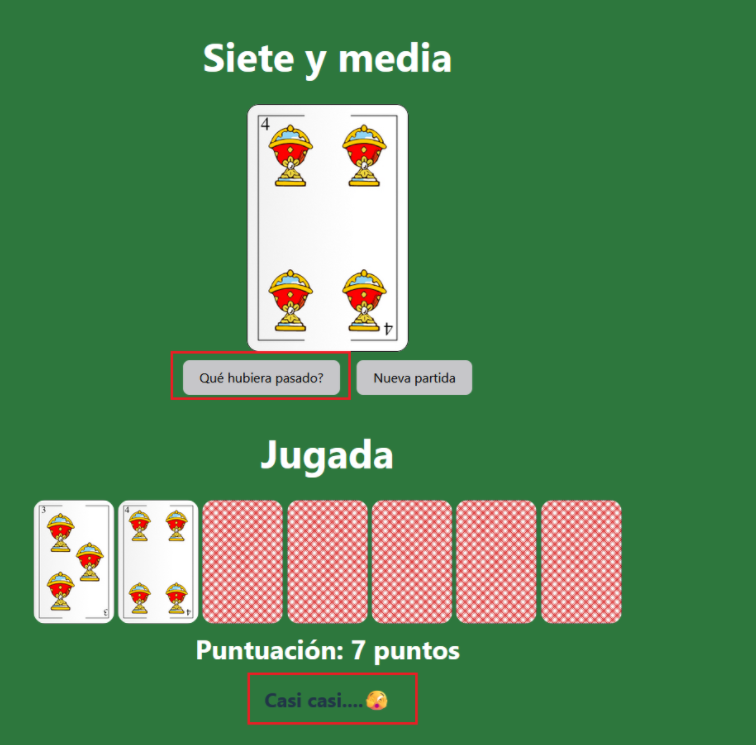
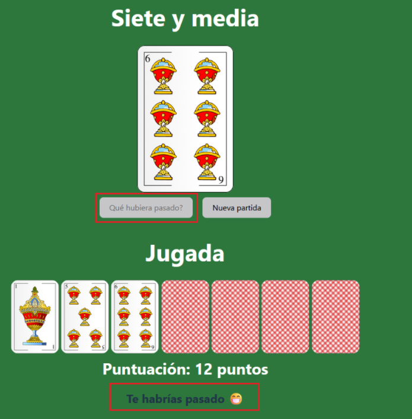

# Laboratorio Módulo 5 Condicionales

## Juego de las 7 y media

[](https://es.wikipedia.org/wiki/Los_jugadores_de_cartas)

<p>Vamos a implementar el juego de cartas de las 7 1/2 en modo solitario.</p>

# Resolución

<p>He utilizado el  <a href="https://github.com/Lemoncode/typescript-sandbox" title="sandbox de TS"> sandbox de TypeScript</a> para la resolución. </p>

<p>Para ordenar de manera aleatoria las cartas he utilizado el <a href="https://programadorwebvalencia.com/algoritmo-de-mezcla-fisher-yates/" title="Algoritmo de Fisher-Yates"> Algoritmo de Fisher-Yates</a> .</p>

<p>He simulado un tapete de juego de cartas:</p>



<p>En el que en la parte superior se muestra la carta que se acaba de descubrir y debajo las cartas que se han levantado en los turnos anteriores.</p>

## Apartados Obligatorios

### Mostrar puntuación

<p> Se muestra la puntuación de la jugada llamando a la función 
<strong>muestraPuntuacion</strong>:</p>

```TypeScript
function muestraPuntuacion() {
  const resultadoElement = document.getElementById("puntuacion");
  if (resultadoElement !== null && resultadoElement !== undefined) {
    resultadoElement.innerHTML =
      "Puntuación: " + puntuacion.toString() + " puntos";
  }
}

```

### Pedir carta

<p> Se ha creado una función <strong>mezclar</strong> que genera un array de 10 cartas aleatorias, sin repetición, que se ejecuta cuando se carga la página. Además se carga el array con las puntuaciones de las cartas en el array.</p>

```TypeScript
function mezclar(lista: number[]) {
  // Copiamos la lista original para no modificarla
  let listaOriginal = lista.slice();

  while (listaOriginal.length > 0) {
    let posicion = Math.floor(Math.random() * listaOriginal.length);
    //Eliminamos el elemento de la listaOriginal
    let elemento = listaOriginal.splice(posicion, 1)[0];
    //Incluimos el elemento de la listaOriginal en la listaMezclada en la posicion[0]
    listaMezclada.unshift(elemento);
    //Cargamos la lista de puntuaciones
    if (listaMezclada[0] > 7 && listaMezclada[0] < 11) {
      listaPuntuacion.unshift(0.5);
    } else {
      listaPuntuacion.unshift(listaMezclada[0]);
    }
  }

  return listaMezclada;
}

```

<p> Se pueden ver por consola los dos array:</p>



<p> Se han creado dos botones y cada uno se usa con una doble función

- Plantarse

Si se planta y no ha sobrepasado la puntuación de 7.5 se cambia el texto a "Qué hubiera pasado?" donde le deja una tirada más y le indica que habría pasado si hubiera pedido una carta más. Y al clickar en el botón se ejecuta la función <strong>plantarse</strong>:

```TypeScript
function plantarse() {
  if (plantado == true) {
    if (numeroCarta < 11) {
      muestraCarta(listaMezclada[numeroCarta]);
      jugada(numeroCarta + 1, listaMezclada[numeroCarta]);
      puntuacion = puntuacion + listaPuntuacion[numeroCarta];
      muestraPuntuacion();
      if (puntuacion > 7.5) {
        muestraMensaje("Te habrías pasado 😁");
      }
      if (puntuacion == 7.5) {
        muestraMensaje("¡La habrías clavado!🙄");
      }
      if (puntuacion < 7.5) {
        muestraMensaje("¡No habrías llegado a  7 y media!🙄");
      }
      numeroCarta = 12;
    }
    if (btPlantarse instanceof HTMLButtonElement) {
      btPlantarse.disabled = true;
    }
  } else {
    if (puntuacion < 4) {
      muestraMensaje("Has sido muy conservador 🙄");
    }
    if (puntuacion >= 4 && puntuacion < 6) {
      muestraMensaje("Te ha entrado el canguelo eh?🤭");
    }
    if (puntuacion >= 6 && puntuacion <= 7) {
      muestraMensaje("Casi casi....🫣");
    }
    if (puntuacion == 7.5) {
      muestraMensaje("¡Lo has clavado!¡Enhorabuena!🥳");
    }
    if (
      btDameCarta instanceof HTMLButtonElement &&
      btPlantarse instanceof HTMLButtonElement
    ) {
      btDameCarta.textContent = "Nueva partida";
      if (puntuacion == 7.5) {
        btPlantarse.disabled = true;
      } else {
        btPlantarse.textContent = "Qué hubiera pasado?";
        plantado = true;
      }
      nuevaPartida = true;
    }
  }
}


```

- Dame carta

Este botón sirve para pedir carta o para iniciar una nueva partida si se ha pasado o si se plantó. Se ejecuta la función <strong>dameCarta</strong> que va recorriendo el array de cartas mostrando la carta que corresponda arriba, actualizando la jugada y la puntuación:

```TypeScript
function dameCarta() {
  if (nuevaPartida == true) {
    location.reload();
  } else if (numeroCarta < 11) {
    muestraCarta(listaMezclada[numeroCarta]);
    jugada(numeroCarta + 1, listaMezclada[numeroCarta]);
    puntuacion = puntuacion + listaPuntuacion[numeroCarta];
    muestraPuntuacion();
    if (puntuacion > 7.5) {
      muestraMensaje("TE PASASTE 😁");
      if (
        btDameCarta instanceof HTMLButtonElement &&
        btPlantarse instanceof HTMLButtonElement
      ) {
        btPlantarse.disabled = true;
        btDameCarta.textContent = "Nueva partida";
        nuevaPartida = true;
      }
    }
    numeroCarta = numeroCarta + 1;
  }
}
```

Se han creado dos funciones <strong>muestraCarta</strong> y <strong>jugada</strong> que crean una url dinámica para recuperar la imagen de la carpeta de /imagenes/ y ponerla en el elemento que le corresponda:

```TypeScript
function muestraCarta(carta: number) {
  const cartaNew = document.getElementById("carta-back");
  const url = "/imagenes/";
  const url2 = "_copas.jpg";
  if (cartaNew instanceof HTMLImageElement) {
    cartaNew.src = url + carta + url2;
  }
}
function jugada(carta: number, valor: number) {
  const idCarta = "carta" + carta;
  const cartaJugada = document.getElementById(idCarta);
  const url = "/imagenes/";
  const url2 = "_copas.jpg";
  if (cartaJugada instanceof HTMLImageElement) {
    cartaJugada.src = url + valor + url2;
  }
}
```

Y además la función <strong>muestraMensaje</strong> para dar mensajes al usuario:

```TypeScript
function muestraMensaje(texto: string) {
  const resultadoElement = document.getElementById("mensaje");
  if (resultadoElement !== null && resultadoElement !== undefined) {
    resultadoElement.innerHTML = texto;
  }
}
```

</p>

# Resultado

<p>

- Pasarse



- Plantarse



- Qué hubiera pasado?



</p>
